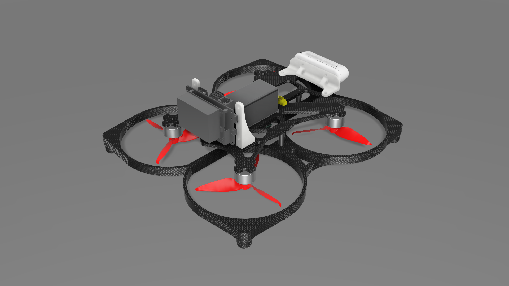

# MIRA — IMAV 2026

<p align="center">
  
  
  
  
</p>

ROS 2 (Humble) offboard velocity control stack for PX4-based UAVs, developed for the **International Micro Air Vehicle Conference (IMAV) 2026**.  
Provides the flight command pipeline between a companion computer and a PX4-based flight controller via Micro XRCE-DDS.  
Supports both **Gazebo SITL simulation** and **real hardware** deployment.

<p align="center">
  
</p>

---

## Table of Contents

- [Repository Structure](#repository-structure)
- [Packages](#packages)
- [Building the Workspace](#building-the-workspace)
- [Running — Simulation (SITL + Gazebo)](#running--simulation-sitl--gazebo)
- [Running — Real Hardware (Pixhawk via USB)](#running--real-hardware-pixhawk-via-usb)
- [`offboard_velocity_control` Node](#offboard_velocity_control-node)
- [Published Topics](#published-topics)
- [Subscribed Topics](#subscribed-topics)
- [Services](#services)
- [Safety Features](#safety-features)
- [Custom Service Definitions](#custom-service-definitions)
- [3D Models](#3d-models)
- [Dependencies](#dependencies)

---

## Repository Structure

```
mira_imav2026/
├── 3D_models/
│   ├── fusion360/                   # Fusion 360 native CAD files (.f3z, .f3d)
│   ├── step/                        # STEP exchange format (.step)
│   └── images/                      # Rendered images of the airframe
├── docker/
│   ├── Dockerfile                   # PX4 + ROS 2 Humble + Gazebo Harmonic image
│   ├── docker-compose.yml           # Container orchestration
│   └── entrypoint.sh               # Runtime setup (PX4 clone, workspace build)
├── mira_gazebo/
│   └── src/
│       └── offboard_velocity_control.cpp   # Main control node
├── mira_msgs/
│   └── srv/
│       ├── SetVelocity.srv
│       └── Takeoff.srv
└── install_jetson.sh                # Native installation for Jetson Orin NX
```

---

## Packages

| Package | Description |
|---------|-------------|
| `mira_gazebo` | Main flight control node (`offboard_velocity_control`) |
| `mira_msgs` | Custom ROS 2 service definitions |

---

## Building the Workspace

### Docker (Simulation / Desktop)

Prerequisites: Docker + Docker Compose. For real hardware: Pixhawk via USB (`/dev/ttyACM0`).

```bash
cd ~/imav_ws/src/mira_imav2026/docker
docker compose up -d
docker exec -it mira_imav2026_sim bash

cd ~/imav_ws
colcon build --symlink-install
source ~/imav_ws/install/setup.bash
```

### Native (Jetson Orin NX)

Target: JetPack 6.x / Ubuntu 22.04 / aarch64.

```bash
chmod +x install_jetson.sh
./install_jetson.sh
```

---

## Running — Simulation (SITL + Gazebo)

Open **3 terminals** inside the container (`docker exec -it mira_imav2026_sim bash`):

**Terminal 1 — PX4 SITL + Gazebo**
```bash
cd ~/PX4-Autopilot
make px4_sitl gz_x500
```

**Terminal 2 — Micro XRCE-DDS Agent**
```bash
MicroXRCEAgent udp4 -p 8888
```

**Terminal 3 — Offboard control node**
```bash
source ~/imav_ws/install/setup.bash
ros2 run mira_gazebo offboard_velocity_control
```

---

## Running — Real Hardware (Pixhawk via USB)

> **PX4 parameter required:** Set `UXRCE_DDS_CFG` to the USB port in QGroundControl → Parameters.

**Terminal 1 — Micro XRCE-DDS Agent (Serial)**
```bash
MicroXRCEAgent serial --dev /dev/ttyACM0 -b 921600
```

**Terminal 2 — Offboard control node**
```bash
source ~/imav_ws/install/setup.bash
ros2 run mira_gazebo offboard_velocity_control
```

---

## `offboard_velocity_control` Node

Controls the drone in **PX4 Offboard mode** via velocity setpoints.  
Publishes setpoints at **10 Hz** and exposes ROS 2 services for arming, takeoff, velocity control, landing, and emergency stop.

### State Machine

```
INIT ──► TAKEOFF ──► VELOCITY
  ▲                     │
  └─── land / estop ────┘
```

| State | Behavior |
|-------|----------|
| `INIT` | Publishes zero velocity; waits for commands |
| `TAKEOFF` | Position control to target altitude (NED frame) |
| `VELOCITY` | Velocity control; auto-hovers when duration expires or heartbeat times out |

---

## Published Topics

| Topic | Type | Description |
|-------|------|-------------|
| `/fmu/in/offboard_control_mode` | `px4_msgs/OffboardControlMode` | Tells PX4 which control dimension is active (position or velocity) |
| `/fmu/in/trajectory_setpoint` | `px4_msgs/TrajectorySetpoint` | Position or velocity setpoint sent to PX4 at 10 Hz |
| `/fmu/in/vehicle_command` | `px4_msgs/VehicleCommand` | MAVLink-style commands (arm, disarm, mode switch, land) |

---

## Subscribed Topics

| Topic | Type | Description |
|-------|------|-------------|
| `/fmu/out/vehicle_local_position` | `px4_msgs/VehicleLocalPosition` | Current yaw used for body→NED frame rotation |
| `/fmu/out/vehicle_status` | `px4_msgs/VehicleStatus` | Arming state and navigation state monitoring |
| `/fmu/out/timesync_status` | `px4_msgs/TimesyncStatus` | XRCE-DDS link heartbeat (warns if silent >2 s) |
| `/fmu/out/battery_status` | `px4_msgs/BatteryStatus` | Battery voltage and remaining capacity |
| `/fmu/out/vehicle_gps_position` | `px4_msgs/SensorGps` | GPS fix type and satellite count (informational) |
| `/fmu/out/vehicle_control_mode` | `px4_msgs/VehicleControlMode` | Offboard engagement and FC arming state |
| `/fmu/out/failsafe_flags` | `px4_msgs/FailsafeFlags` | Critical failsafe conditions |
| `/fmu/out/vehicle_attitude` | `px4_msgs/VehicleAttitude` | Quaternion orientation (NED → FRD) |
| `/fmu/out/vehicle_odometry` | `px4_msgs/VehicleOdometry` | EKF2 fused odometry estimate |
| `/fmu/out/sensor_combined` | `px4_msgs/SensorCombined` | Raw IMU (gyro + accelerometer + clipping detection) |
| `/cmd_vel` | `geometry_msgs/Twist` | External velocity commands in body frame (FRD) |

---

## Services

### `~/arm` — `std_srvs/Trigger`
Arms the drone and switches to Offboard mode.

**Pre-flight checks:**
- ESTOP must **not** be active
- Estimator must report valid position + velocity
- No critical failsafe active

```bash
ros2 service call /offboard_velocity_control/arm std_srvs/srv/Trigger
```

---

### `~/takeoff` — `mira_msgs/Takeoff`
Arms, switches to Offboard mode, and climbs to the requested altitude.

| Field | Type | Description |
|-------|------|-------------|
| `altitude` | `float32` | Target altitude in **metres** (positive = up) |

**Pre-flight checks:** ESTOP inactive, estimator valid, battery ≥ 20%.  
**Limit:** Clamped to max 50 m (`MAX_ALTITUDE`).

```bash
ros2 service call /offboard_velocity_control/takeoff \
  mira_msgs/srv/Takeoff "altitude: 5.0"
```

---

### `~/set_velocity` — `mira_msgs/SetVelocity`
Commands a velocity for an optional duration.

| Field | Type | Description |
|-------|------|-------------|
| `vx` | `float32` | X velocity (m/s) — forward in `body` |
| `vy` | `float32` | Y velocity (m/s) — left in `body` |
| `vz` | `float32` | Z velocity (m/s) — **NED: negative = up** |
| `yaw` | `float32` | Target yaw (rad) |
| `duration` | `float32` | Duration in seconds (`0` = indefinite) |
| `frame_id` | `string` | `"body"` (drone-relative) or `"ned"` / `"world"` (NED frame) |
| `auto_arm` | `bool` | If `true`, arms and switches to Offboard automatically |

**Limits:** `vx`, `vy` clamped to ±5 m/s · `vz` clamped to ±2 m/s.  
When `frame_id = "body"`, velocities are rotated to NED using the current yaw heading.

```bash
ros2 service call /offboard_velocity_control/set_velocity \
  mira_msgs/srv/SetVelocity \
  "{vx: 1.0, vy: 0.0, vz: 0.0, yaw: 0.0, duration: 3.0, frame_id: 'body', auto_arm: false}"
```

---

### `~/land` — `std_srvs/Trigger`
Commands PX4 `NAV_LAND` and resets the node to `INIT` state.

```bash
ros2 service call /offboard_velocity_control/land std_srvs/srv/Trigger
```

---

### `~/estop` — `std_srvs/Trigger`
**Emergency stop.** Commands immediate landing and locks all further commands.

> ⚠️ Once triggered, ESTOP can only be cleared by restarting the node.

```bash
ros2 service call /offboard_velocity_control/estop std_srvs/srv/Trigger
```

---

## Safety Features

| Feature | Detail |
|---------|--------|
| **Estimator guard** | ARM and TAKEOFF rejected if EKF2 has not fused horizontal position + velocity |
| **Battery gate** | TAKEOFF rejected if remaining capacity < 20% |
| **Failsafe monitoring** | ARM rejected on `fd_critical_failure`, `attitude_invalid`, or `local_position_invalid` |
| **Velocity clamping** | `vx`, `vy` ≤ 5 m/s · `vz` ≤ 2 m/s |
| **Altitude limit** | Takeoff target clamped to 50 m AGL |
| **Heartbeat failsafe** | Auto-hover if no `set_velocity` or `/cmd_vel` received for >5 s |
| **XRCE-DDS watchdog** | Warning logged every 1 s if timesync silent for >2 s |
| **IMU clipping detection** | Warns on accelerometer clipping events |
| **ESTOP lock** | Emergency stop disables all commands until node restart |

---

## Custom Service Definitions

### `mira_msgs/Takeoff`
```
float32 altitude   # metres, positive = up
---
bool    success
string  message
```

### `mira_msgs/SetVelocity`
```
float32 vx         # m/s (clamped ±5.0)
float32 vy         # m/s (clamped ±5.0)
float32 vz         # m/s NED (clamped ±2.0)
float32 yaw        # rad
float32 duration   # seconds (0 = indefinite)
string  frame_id   # 'body', 'ned', or 'world'
bool    auto_arm
---
bool    success
string  message
```

---

## 3D Models

The `3D_models/` directory contains the mechanical design of the MIRA airframe, organized by file type:

```
3D_models/
├── fusion360/          # Fusion 360 native CAD files
├── step/               # STEP exchange format (vendor-neutral)
└── images/             # Rendered images
```

| Component | Fusion 360 | STEP |
|-----------|-----------|------|
| Full assembly | `fusion360/mira_assembly.f3z` | `step/mira_assembly.step` |
| Main body frame | `fusion360/mira_main_body.f3d` | `step/mira_main_body.step` |
| Propeller guards | `fusion360/mira_propellers_guard.f3d` | `step/mira_propellers_guard.step` |
| Spacer | `fusion360/mira_spacer.f3d` | `step/mira_spacer.step` |

---

## Dependencies

| Dependency | Version |
|------------|---------|
| ROS 2 | Humble |
| PX4-Autopilot | latest (`main`) |
| px4_msgs | latest (`main`) |
| px4_ros_com | latest (`main`) |
| Gazebo Harmonic | `gz-harmonic` |
| Micro XRCE-DDS Agent | v2.4.3 |
